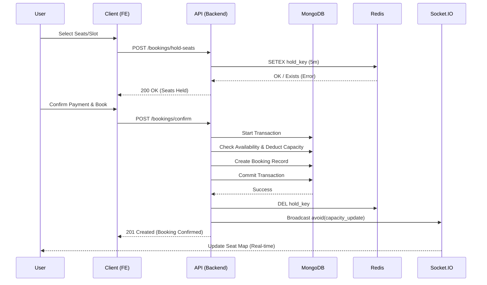
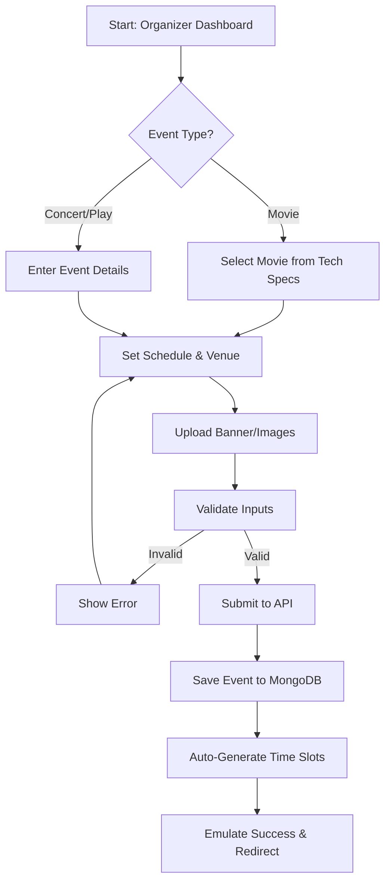

# VENUE Architecture Documentation

## 1. Project Overview

VENUE is a high-performance, full-stack event and movie booking platform designed to handle concurrent user interactions, real-time updates, and complex scheduling logic. It features a strict separation of concerns between the client (React) and server (Express) applications, ensuring scalability and maintainability.

## 2. Technology Stack

### Backend (`venue-backend`)
- **Runtime**: Node.js
- **Framework**: Express.js
- **Database**: MongoDB (with Mongoose ODM) for persistent storage
- **Caching & Queues**: Redis (via `ioredis`) for rate limiting and potential caching
- **Real-time**: Socket.IO for live updates (seat availability, notifications)
- **Authentication**: JWT (JSON Web Tokens) with HTTP-only cookies
- **Validation**: Zod for request schema validation
- **Logging**: Winston for structured logging
- **Security**: Helmet, XSS-Clean, Express-Mongo-Sanitize, CORS

### Frontend (`venue-frontend`)
- **Framework**: React 19 (via Vite)
- **State Management**: React Query (TanStack Query) for server state, React Context for auth
- **Routing**: React Router v7
- **Styling**: TailwindCSS, clsx, tailwind-merge
- **UI Components**: Radix UI primitives (implied), Lucide React icons
- **Animations**: Framer Motion
- **Forms**: React Hook Form with Zod resolvers
- **HTTP Client**: Axios with interceptors for token refresh

## 3. User Booking Workflow

The booking process is the core user journey, involving complex state management and concurrency checks.



## 4. Organizer Event Creation Workflow

Organizers follow a structured flow to create events and generate time slots automatically.



## 5. System Architecture Diagram

```mermaid
graph TD
    Client[Client (React SPA)]
    LB[Load Balancer / Nginx]
    API[API Server (Express)]
    Socket[Socket.IO Server]
    DB[(MongoDB Primary)]
    Redis[(Redis Cache)]

    Client -->|HTTP/REST| LB
    Client -->|WebSocket| Socket
    LB --> API
    API -->|Read/Write| DB
    API -->|Cache/Rate Limit| Redis
    Socket -->|Pub/Sub| Redis
```

## 6. Directory Structure

### Backend
```
venue-backend/src/
├── config/             # Database and environment configuration
├── middlewares/        # Express middlewares (Auth, Validation, Error Handling)
├── modules/            # Feature-based modules (Controller-Service-Model pattern)
│   ├── auth/           # Authentication & Registration
│   ├── bookings/       # Booking logic, concurrency handling
│   ├── events/         # Event management (CRUD)
│   ├── movies/         # Movie management
│   ├── organizer/      # Organizer-specific features
│   ├── slots/          # Time slot generation and management
│   └── users/          # User profile management
├── scripts/            # Database seeding and maintenance scripts
├── services/           # Shared business logic and external services
└── utils/              # Helper functions (Response handlers, etc.)
```

### Frontend
```
venue-frontend/src/
├── api/                # Axios instances and API service functions
├── components/         # Reusable UI components
│   ├── layout/         # Layout wrappers (Navbar, ProtectedRoute)
│   ├── ui/             # Generic UI elements (Buttons, Inputs, Modals)
│   └── visuals/        # Pure display components
├── context/            # React Context providers (AuthContext)
├── pages/              # Route-level page components
│   ├── organizer/      # Organizer portal pages
│   └── ...             # User-facing pages (Home, Events, Booking)
├── routes/             # App routing configuration
└── socket/             # Socket.IO client initialization
```

## 7. Core Modules & Data Flow

### Authentication
- Uses **JWT** strategies.
- **Access Token**: Short-lived, sent in HTTP-Only cookies.
- **Refresh Token**: Longer-lived, used to effortlessly rotate access tokens.
- **RBAC**: Middleware checks `user.role` (user, organizer, admin) to protect routes.

### Booking System
The booking system is the critical path of the application, designed for consistency.
1.  **Selection**: User selects seats/slots.
2.  **Hold**: (Optional) Temporary hold on seats via Redis/DB to prevent double booking during checkout.
3.  **Transaction**: MongoDB Transactions (`session.withTransaction`) ensure atomicity.
    - Check availability.
    - Deduct capacity/Mark seats as booked.
    - Create booking record.
4.  **Confirmation**: Success response sent to client; Socket.IO broadcasts capacity update to other users.

### Slot Generation
- Automatic generation of time slots based on event duration and operating hours.
- Handles logic to prevent overlapping slots for the same venue/resource.

## 8. Key Design Decisions

1.  **Optimistic vs. Pessimistic Locking**: The system currently employs pessimistic validation within transactions—checking availability *during* the write to ensure no overbooking occurs, utilizing MongoDB's atomic document updates.
2.  **Modular Monolith**: Code is organized by feature (Modules) rather than technical layer (Controllers/Models folders). This makes scaling the team easier as developers can own specific domains.
3.  **Client-Side Caching**: React Query is heavily used to cache API responses, reducing server load and making the UI feel instant. Stale-while-revalidate strategies keep data fresh.
