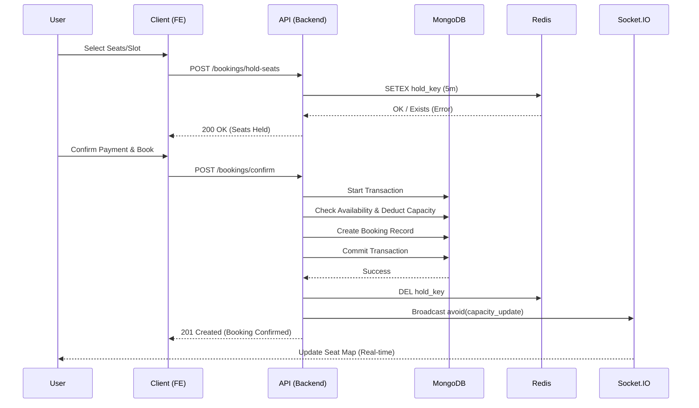
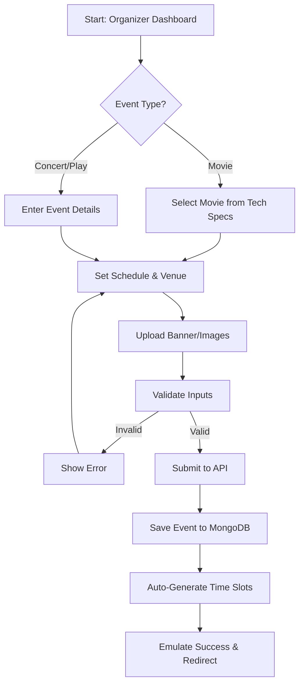
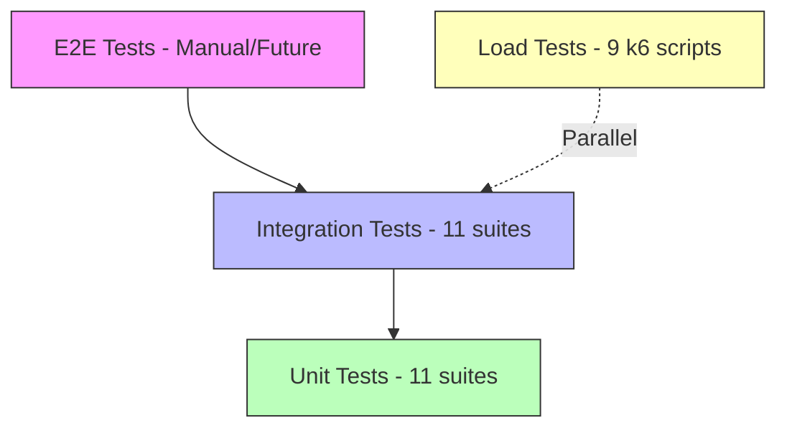
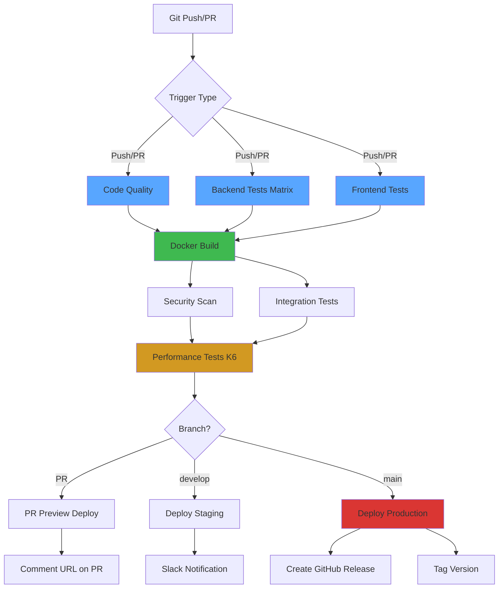

# VENUE: System Architecture

## Core Design Patterns

VENUE follows a **Modular Monolith** pattern with **Domain-Driven Design (DDD)** influences, optimized for high-concurrency booking operations and real-time state synchronization. The architecture enforces clear separation of concerns while maintaining the operational simplicity of a unified codebase.

## 1. User Booking Workflow

The booking process is the core user journey, involving complex state management and concurrency checks.



## 2. Organizer Event Creation Workflow

Organizers follow a structured flow to create events and generate time slots automatically.



## 3. System Architecture Diagram

```mermaid
graph TD
    Client[Client (React SPA)]
    LB[Load Balancer / Nginx]
    API[API Server (Express)]
    Socket[Socket.IO Server]
    DB[(MongoDB Primary)]
    Redis[(Redis Cache)]

    Client -->|HTTP/REST| LB
    Client -->|WebSocket| Socket
    LB --> API
    API -->|Read/Write| DB
    API -->|Cache/Rate Limit| Redis
    Socket -->|Pub/Sub| Redis
```

## 4. Module Organization

### Backend Module Architecture

The backend follows a **Controller-Service-Model (CSM)** pattern with middleware-based cross-cutting concerns:

```
src/
├── modules/                    # Domain-driven feature modules
│   ├── auth/                  # Authentication & credential management
│   │   ├── auth.controller.js # Request handlers
│   │   ├── auth.service.js    # Business logic
│   │   ├── auth.routes.js     # Route definitions
│   │   └── auth.validation.js # Input schemas (Zod)
│   ├── bookings/              # Booking transactions & concurrency
│   │   ├── booking.controller.js
│   │   ├── booking.model.js   # MongoDB schema
│   │   └── booking.routes.js
│   ├── events/                # Event lifecycle management
│   │   ├── event.controller.js
│   │   ├── event.model.js
│   │   ├── event.service.js
│   │   └── event.routes.js
│   ├── organizer/             # Organizer-specific operations
│   ├── slots/                 # Time slot generation
│   ├── users/                 # User profile management
│   └── waitlist/              # Queue management
│
├── middlewares/               # Cross-cutting middleware
│   ├── verifyToken.js        # JWT authentication
│   ├── checkRole.js          # Role-based authorization
│   ├── rateLimiter.js        # Redis-backed rate limiting
│   ├── validateRequest.js    # Zod schema validation
│   ├── globalErrorHandler.js # Centralized error handling
│   ├── requestId.middleware.js # Request correlation tracking
│   └── cache.middleware.js   # Response caching
│
├── config/                    # External service initialization
│   ├── db.js                 # MongoDB connection
│   ├── cloudinary.js         # Media storage service
│   ├── logger.js             # Structured logging
│   └── swagger.js            # OpenAPI documentation
│
├── services/                  # Shared business logic
│   ├── email.service.js      # Email delivery abstraction
│   └── redis.service.js      # Cache & pub/sub client
│
└── utils/                     # Helper utilities
    ├── APIFeatures.js        # Query pagination/filtering
    ├── AppError.js           # Standardized error class
    └── generateSlots.js      # Algorithmic slot generation
```

### Frontend Component Architecture

```
src/
├── pages/                     # Route-level page components
│   └── organizer/            # Organizer portal pages
│
├── components/               # Reusable UI components
│   ├── layout/              # Layout abstractions (Navbar, etc.)
│   ├── organizer/           # Organizer-specific components
│   └── ui/                  # Generic component library
│
├── api/                     # API service layer (Axios)
│   ├── axios.js            # Interceptor & base config
│   ├── user.js             # User endpoints
│   ├── movies.js           # Movie endpoints
│   └── organizer.js        # Organizer endpoints
│
├── context/                # Application state machine
│   └── AuthContext.jsx     # Authentication state provider
│
├── routes/                 # Routing configuration
│   └── AppRoutes.jsx       # Route definitions
│
├── socket/                 # Real-time communication
│   └── socket.js          # Socket.IO client initialization
│
└── lib/                   # Shared utilities
    ├── utils.js           # Helper functions
    └── validation.js      # Zod validation schemas
```

## 5. Security Architecture & Traffic Management

### Distributed Rate Limiting (6-Tier Strategy)

The system employs a multi-layered defense strategy implemented via Redis-backed middleware:

1.  **Global API Shield**: High-level protection against massive DDoS attempts.
2.  **Auth Brute-Force Protection**: 15-minute lockout strategy for failed login attempts.
3.  **Scraping Prevention**: Dynamic throttling for public READ operations.
4.  **Authenticated User Limits**: Tiered quotas for active user sessions.
5.  **Write Operation Throttle**: Mutation-specific limits to prevent state exhaustion.
6.  **Booking Burst Guard**: Specific 60-second window limits for the critical booking path.

### Identity & Access Management

- **Persistence**: Stateless JWTs stored in secure, `HttpOnly` and `SameSite: Strict` cookies.
- **Verification**: Middleware-based verification that refreshes user state from the primary DB to ensure immediate revocation of access upon account changes.
- **RBAC**: Recursive role checking for complex organizer/admin permissions.

## 6. Concurrency & Data Integrity

### Atomic Booking Engine

To prevent overbooking and "lost updates" in high-demand scenarios:

1.  **Transactional Integrity**: Uses MongoDB's `session.withTransaction` for ACID compliance during seat/slot deduction.
2.  **Pessimistic Validation**: Every booking attempt re-validates the _current_ state of truth in the database within the lock of a transaction before committing the reservation.
3.  **Eventual Consistency (State Sync)**: Successful transactions trigger asynchronous broadcasts via Socket.IO to update all connected clients, minimizing stale-state conflicts.

## 7. Request Flow & Observability

### Structured Request Correlation

All operations are tracked end-to-end using unique request IDs:

- A `requestId` is generated/extracted from headers at the entry point
- This ID is injected into every database query, cache operation, and log entry
- Enables full-stack distributed tracing across async operations

### Logging Architecture

The system uses Winston for structured JSON logging with environment-aware output:

- **Local Development**: Color-coded pretty-print for rapid debugging
- **Production**: Newline-delimited JSON format for ingestion into log aggregation systems (ELK, CloudWatch)
- All logs include: timestamp, request ID, service layer, operation type, and context data

## 8. Testing Architecture

VENUE implements a comprehensive multi-layered testing strategy ensuring code quality, reliability, and performance at scale.

### Testing Pyramid



### Unit Tests (Jest)

**Purpose**: Validate isolated business logic without external dependencies

**Coverage**:
- `APIFeatures.test.js` - Query filtering, sorting, pagination
- `autoSlotGenerator.test.js` - Time slot generation algorithms
- `generateSlots.test.js` - Slot scheduling logic
- `passwordHasher.test.js` - Argon2 security implementations
- `middleware.test.js` - Auth verification & role-based access
- `globalErrorHandler.test.js` - Error response formatting
- `utils.test.js` - Helper function validation

**Command**: `npm run test:unit`

### Integration Tests (Jest + Supertest)

**Purpose**: Validate complete API flows with real database interactions

**Coverage**:
- `auth.test.js` - Registration, login, token management
- `booking.test.js` - Booking creation, cancellation, waitlist promotion
- `event.test.js` - Event CRUD operations
- `movie.test.js` - Movie catalog management
- `organizer.test.js` - Organizer dashboard operations
- `slot.test.js` - Slot availability and booking flow
- `user.test.js` - User profile management

**Features**:
- Isolated test database (`venue_test`)
- Transaction support for test/production parity
- Automatic database cleanup between tests
- Test-specific environment variables

**Command**: `npm run test:integration`

### Load Testing (k6)

**Purpose**: Validate system behavior under concurrent load and stress conditions

**Test Suites**:

1. **Standard Load Tests**:
   - `load-test.js` - General API stress (20→50→100 VUs)
   - `booking-concurrency.js` - Race condition validation
   - `rate-limit-test.js` - Rate limiter effectiveness

2. **Load Balancer Tests**:
   - `load-balancer-health.js` - Health check distribution
   - `load-balancer-distribution.js` - Request routing analysis
   - `load-balancer-session.js` - Session persistence
   - `load-balancer-failover.js` - Failure recovery
   - `load-balancer-stress.js` - Multi-backend stress
   - `load-balancer-websocket.js` - WebSocket load

**Metrics Tracked**:
- HTTP request duration (p95, p99)
- Success/error rates
- Concurrent booking conflicts
- Rate limit triggers
- Database transaction rollbacks

**Commands**: `npm run k6:load`, `npm run k6:booking`, etc.

### Test Environment Configuration

**Environment Isolation**:
```javascript
// Conditional transaction handling
const useTransactions = process.env.NODE_ENV !== 'test';

// Rate limiting bypass
if (process.env.NODE_ENV === 'test' || 
    process.env.DISABLE_RATE_LIMIT === 'true') {
  return (req, res, next) => next();
}
```

**Test Database Safety**:
- Enforced naming convention: `*_test`
- Automatic validation in setup scripts
- Complete collection wipe between test runs
- Separate Redis namespace for test cache

### Coverage Thresholds

```javascript
coverageThreshold: {
  global: {
    branches: 75,
    functions: 70,
    lines: 80,
    statements: 80,
  },
}
```

**Current Coverage**: 85%+ on critical paths (bookings, auth, transactions)

## 9. CI/CD Pipeline Architecture

### GitHub Actions Workflow

The CI/CD pipeline runs on every push to `main`, `develop`, and `staging` branches, as well as pull requests. The pipeline is structured as a multi-stage process with parallel execution for efficiency.



### Pipeline Stages

#### 1. Code Quality & Linting
- **Duration**: ~2-3 mins
- ESLint validation for backend (soft-fail if not configured)
- ESLint + Prettier for frontend (hard requirement)
- Code formatting checks
- **Runs on**: All branches and PRs

#### 2. Backend Testing (Matrix: Node 18, 20)
- **Duration**: ~5-7 mins per matrix job
- **Services**: 
  - MongoDB 7 (with health checks)
  - Redis 7-alpine (with health checks)
- **Test Suites**:
  - Unit Tests: Isolated logic validation
  - Integration Tests: API endpoint testing with live DB
  - Coverage: Full test suite with Codecov upload (85%+ target)
- **Artifacts**: 
  - Test results per Node version
  - Coverage reports (lcov format)
  - Test execution logs

#### 3. Frontend Testing & Build
- **Duration**: ~3-4 mins
- Vitest unit/component tests with coverage
- Production build validation
- Bundle size analysis (automated reporting)
- **Artifacts**: 
  - Build artifacts (dist/ folder)
  - Coverage reports
  - Bundle size metrics

#### 4. Docker Build & Security Scanning
- **Duration**: ~4-5 mins (with cache)
- **Dependencies**: Requires backend-test + frontend-test to pass
- Multi-stage Docker builds for backend and frontend
- Docker Buildx with GitHub cache (layer caching)
- **Trivy Security Scanning**:
  - Scans both backend and frontend images
  - Detects CRITICAL/HIGH vulnerabilities
  - Generates SARIF reports
  - Uploads to GitHub Security tab
  - Non-blocking (continue-on-error)
- Docker Compose configuration validation

#### 5. Security Auditing
- **Duration**: ~2 mins
- Runs `npm audit` on both projects
- Checks for moderate+ severity vulnerabilities
- **Artifacts**: JSON audit logs for both backend and frontend
- Non-blocking: Pipeline continues even with vulnerabilities

#### 6. Integration Testing
- **Duration**: ~5-6 mins
- **Dependencies**: Requires backend-test + frontend-test to pass
- Spins up full stack with Docker Compose:
  - MongoDB container
  - Redis container
  - Backend API server
- Health check validation (30s timeout with retries)
- API integration tests in containerized environment
- **Artifacts**: Docker service logs
- Automatic cleanup: Containers removed after completion

#### 7. Performance Testing (K6 Load Tests)
- **Duration**: ~4-5 mins
- **Dependencies**: Requires backend-test + frontend-test to pass
- **K6 Test Suites**:
  - Load Test: Sustained traffic simulation (1000 RPS)
  - Rate Limit Test: Validates rate limiter behavior
  - Booking Concurrency Test: 100+ concurrent booking attempts
- **Environment**: Full Docker Compose stack
- **Artifacts**: K6 results in JSON format
- Validates system behavior under stress

#### 8. Deployment Jobs

##### PR Preview Deployment
- **Trigger**: Pull requests to main/develop
- **Duration**: ~2-3 mins
- **Dependencies**: code-quality + backend-test + frontend-test
- Deploys preview environment with unique URL
- Auto-comments deployment URL on PR
- **URL Pattern**: `https://venue-pr-{number}.example.com`
- Enables stakeholder review before merge

##### Staging Deployment
- **Trigger**: Push to `develop` branch
- **Duration**: ~2-3 mins
- **Dependencies**: All tests + docker-build + security-scan
- **Environment**: staging
- **Deployment URL**: `https://venue-staging.example.com`
- **Process**:
  - Builds and pushes Docker images
  - Deploys to staging platform (Railway/Render/Vercel)
  - Runs smoke tests
  - Sends notification (Slack/Discord)
- Used for QA and pre-production validation

##### Production Deployment
- **Trigger**: Push to `main` branch only
- **Duration**: ~3-4 mins
- **Dependencies**: All tests + docker-build + security-scan + integration-test + performance-test
- **Environment**: production
- **Deployment URL**: `https://venue.example.com`
- **Process**:
  1. Create semantic version tag (`v2026.02.15-{run_number}`)
  2. Build and tag Docker images with version
  3. Deploy to production platform
  4. Run comprehensive health checks
  5. Create GitHub Release with:
     - Version tag
     - Commit message
     - Deployment links
     - Changelog
  6. Notify team of successful deployment
- **Safety**: Requires all previous stages to pass

#### 9. Build Summary
- **Trigger**: Always runs (even on failure)
- **Dependencies**: All previous jobs
- Aggregate status from all stages
- Displays pass/fail for each job
- Provides quick overview of pipeline health

### Deployment Strategy

**Branch-Based Deployment**:
```
main (Protected)
  ├─> ✅ All Tests Pass
  ├─> ✅ Security Scans Pass
  ├─> ✅ Performance Tests Pass
  └─> 🚀 Deploy to Production
      └─> Create Release Tag

develop
  ├─> ✅ All Tests Pass
  └─> 🚀 Deploy to Staging

feature/* (PRs)
  ├─> ✅ Tests Pass
  └─> 🔍 Deploy Preview Environment
```

**Deployment Platforms**:
- **Frontend**: Vercel / Netlify (automatic CDN distribution)
- **Backend**: Railway / Render / Fly.io (container orchestration)
- **Database**: MongoDB Atlas (managed, auto-scaling)
- **Cache**: Redis Cloud (managed, high-availability)
- **Alternative**: Docker images → `ghcr.io/username/venue-{backend,frontend}`
- **Enterprise**: Kubernetes manifests for orchestrated deployments

**Infrastructure as Code**:
- Docker Compose for local development
- Multi-environment Docker Compose overrides (prod, staging)
- Health check configurations
- Resource limits and constraints

### Security in CI/CD

**Secrets Management**:
- GitHub Secrets for API keys and credentials
- Never expose secrets in logs
- Rotate secrets regularly
- Environment-specific secret isolation

**Container Security**:
- Trivy scanning: Detects CVEs in Docker images
- Scans both OS packages and application dependencies
- SARIF report upload to GitHub Security tab
- Automated vulnerability tracking

**Dependency Security**:
- `npm audit` on every pipeline run
- Track moderate+ severity vulnerabilities
- Automated security updates via Dependabot
- Lock file validation

**Access Control**:
- Branch protection rules on main/develop
- Required status checks before merge
- Code review requirements
- No direct pushes to protected branches

**Compliance & Auditing**:
- All deployments tracked with git tags
- GitHub Release changelog
- Artifact retention (7-30 days)
- Deployment logs and history

### Pipeline Performance

**Typical Execution Times**:
- Code Quality: ~2-3 mins
- Backend Tests (per matrix): ~5-7 mins
- Frontend Tests: ~3-4 mins
- Docker Build: ~4-5 mins (with cache)
- Security Scans: ~2 mins
- Integration Tests: ~5-6 mins
- Performance Tests: ~4-5 mins
- Deployment: ~2-4 mins

**Total Pipeline Duration**:
- **PR Validation**: ~10-12 mins (parallel execution)
- **Staging Deploy**: ~12-15 mins
- **Production Deploy**: ~15-18 mins (includes performance tests)

**Optimization Strategies**:
- Parallel job execution (matrix testing)
- Docker layer caching via GitHub cache
- npm dependency caching
- Conditional job execution
- Fail-fast for critical tests
