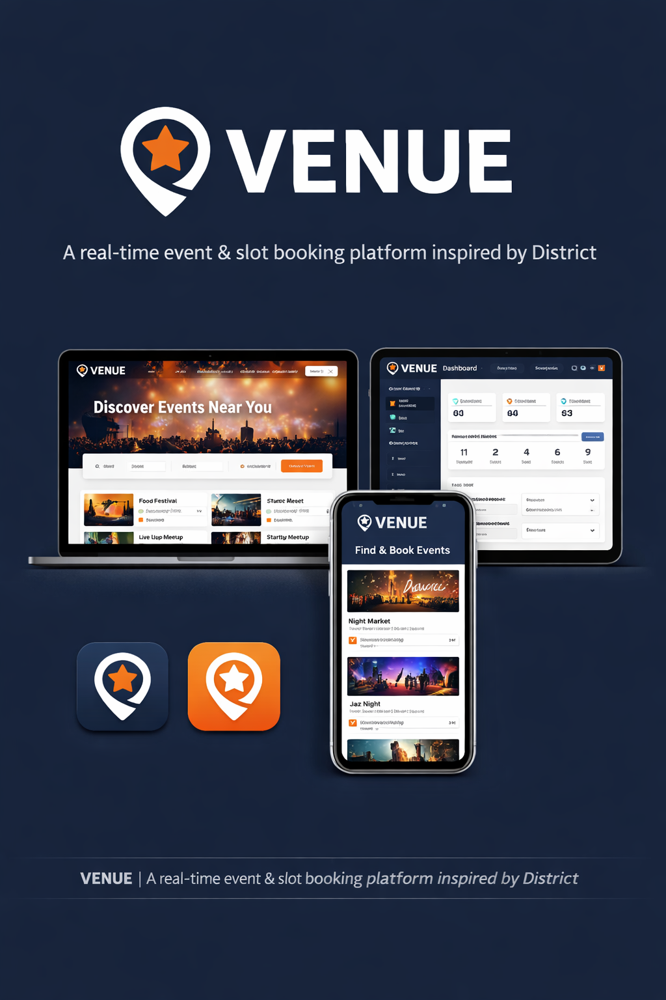

# VENUE 🎟️

A production-grade event and slot booking platform demonstrating full-stack system design, robust backend engineering, and modern frontend architecture.

VENUE is built to handle real-world challenges: concurrent bookings, capacity management, role-based access control, and seamless user experiences at scale. Inspired by modern event platforms, it combines backend reliability with frontend polish.



---

## Key Features

### Backend Engineering
- **JWT-based Authentication** – Secure, stateless authentication with token-based access
- **Role-Based Access Control** – Multi-tier permissions (Admin, Organizer, User) with fine-grained authorization checks
- **Organizer-Only Event Creation** – Restricted event management with validation and authorization middleware
- **Automatic Slot Generation** – Intelligent slot scheduling algorithm for event time windows
- **Concurrency-Safe Booking System** – Race condition handling, atomic operations, and capacity constraints
- **Waitlist Management** – Graceful handling of full slots with automatic promotion logic
- **Modular Clean Architecture** – Separation of concerns with controllers, models, routes, and utilities

### Frontend Experience
- **React-Based UI** – Component-driven, scalable frontend architecture
- **Responsive & Intuitive Design** – Mobile-first approach with smooth, predictable interactions
- **Planned 3D Immersion** – Integration of Three.js for immersive visual elements and enhanced user engagement
- **Performance-Focused** – Optimized asset loading, efficient state management, and smooth animations

---

## What This Project Demonstrates

**For Backend**: Production-grade API design with attention to security (JWT, role-based middleware), data consistency (concurrent operations, transactions), and system scalability (modular architecture, clean separation of concerns).

**For Frontend**: Modern React patterns with a focus on UX polish, responsive design, and performance optimization.

**Overall**: A complete, deployable system that bridges the gap between engineering rigor and user experience.

---

## Tech Stack

### Backend
- **Runtime**: Node.js
- **Framework**: Express.js
- **Database**: MongoDB
- **Authentication**: JWT
- **Architecture**: Modular, controller-based structure

### Frontend
- **Framework**: React
- **Styling**: Responsive CSS/UI framework
- **3D Graphics**: Three.js (planned)
- **State Management**: React hooks / Context API

---

## Project Structure

```
VENUE/
├── venue-backend/                 # Express.js API server
│   ├── src/
│   │   ├── app.js                # Express application setup
│   │   ├── config/
│   │   │   └── db.js            # MongoDB connection
│   │   ├── middlewares/
│   │   │   ├── checkRole.js      # Role-based authorization
│   │   │   └── verifyToken.js    # JWT verification
│   │   ├── modules/              # Feature modules
│   │   │   ├── auth/             # Authentication endpoints
│   │   │   ├── events/           # Event management
│   │   │   ├── bookings/         # Booking logic & concurrency
│   │   │   ├── slots/            # Slot generation & management
│   │   │   └── users/            # User profiles
│   │   └── utils/
│   │       └── generateSlots.js  # Slot algorithm
│   └── package.json
└── venue-frontend/                # React frontend application
    ├── src/
    ├── package.json
```

---

## Current Status

✅ **Backend**: Core API complete with authentication, authorization, and booking logic  
🚀 **Frontend**: React scaffold in place; UI development in progress  
📋 **Next Phase**: Enhanced UX with animations, 3D integration, and performance optimization

---

## Getting Started

### Backend Setup
```bash
cd venue-backend
npm install
npm start
```

### Frontend Setup
```bash
cd venue-frontend
npm install
npm start
```

---

## License

See [LICENSE](LICENSE) for details.
